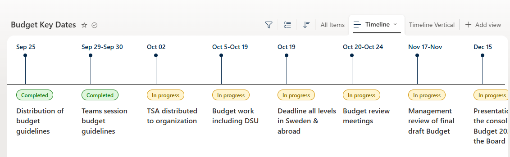

# Key Dates Timeline

## Summary

Beautiful horizontal timeline view for budget key dates/milestones. Shows status badges, milestone titles with hover cards containing descriptions and "Learn more" links.

## View requirements

This sample works with any list that has the following columns:

| Type | Internal Name | Required | Notes |
|------|--------------|----------|-------|
| Single line of text | Title | Yes | Date label (e.g. "Sep 25") |
| Choice | Status | Yes | Values: `Completed`, `In progress` |
| Single line of text / Multiple lines of text | Milestone | Yes | Milestone title |
| Multiple lines of text | Description | Yes | Details shown in hover card |
| Hyperlink | Link | No | Optional link for "Learn more" |

## Sample

| Solution                        | Author(s)          |
|---------------------------------|--------------------|
| key-dates-timeline.json  | [Anand Ragav](https://github.com/anandragav) |

## Version history

| Version | Date          | Comments              |
|---------|---------------|-----------------------|
| 1.0     | July 20, 2026 | Initial release       |

## Disclaimer

**THIS CODE IS PROVIDED AS IS WITHOUT WARRANTY OF ANY KIND, EITHER EXPRESS OR IMPLIED, INCLUDING ANY IMPLIED WARRANTIES OF FITNESS FOR A PARTICULAR PURPOSE, MERCHANTABILITY, OR NON-INFRINGEMENT.**

---

